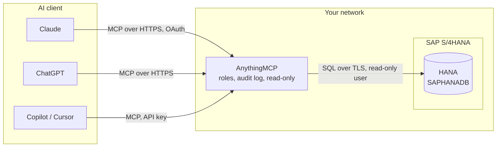

# Architecture

- **AnythingMCP** runs with Docker Compose on a host that reaches the HANA SQL port. It holds the connector, its encrypted credentials, the MCP roles and the audit log in its own PostgreSQL.
- **The connector** opens a session per call with the bundled `hdb` driver (or SAP's `@sap/hana-client`, installed by you), sets `CDS_CLIENT` from the SAP client, switches the transaction to read-only, runs one statement and closes the session.
- **The tools** are fixed, read-only queries on SAP's dictionary (`DD02L`, `DD03L`, `DD04T`, `DD07T`, `DD08L`, the CDS annotations) and organization tables, a static guide to the data model, and `sap_query` for the model's own `SELECT`.
- **The client** only sees tool names, descriptions and results. It never connects to HANA.

## One request

1. The user asks Claude "Which customers are more than 60 days overdue?".
2. Claude calls `sap_guide` (no database access), then `sap_org_structure` for the company codes.
3. It looks up the right table and fields with the dictionary tools, then calls `sap_query` with a `SELECT` on `ACDOCA`.
4. AnythingMCP checks the role, runs the statement read-only with the row cap and timeout, logs the call and returns the rows.
5. Claude answers, stating the key date and currency it used.
